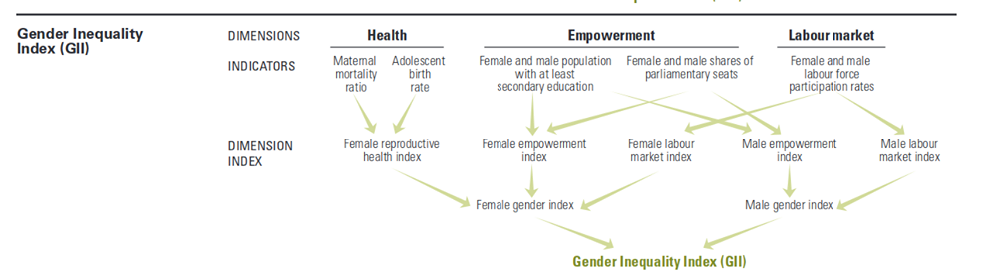

# Présentation

Ce document vise à étudier les inégalités entre hommes et femmes à travers le monde. Les données portent sur 188 pays et comparent les genres selon trois axes : la santé, l'autonomie, et leur présence sur le marché du travail.  
Dans les colonnes du jeu de données, on a donc les informations suivantes :

+ *Country* : le pays concerné
+ *Gender Inequality Index ou GII* - son indice d'inégalité de genre (compris entre 0 et 1)
+ *Maternal Mortality Ratio* - la quantité de morts en couche en moyenne sur 1000 naissances
+ *Adolescent Birth Rate* - le nombre de mères en moyenne sur 1000 femmes de 15 à 19 ans
+ *Percent Representation in Parliament* - la proportion (en %) de femmes au parlement
+ *Population with Secondary Education : Male* - la proportions d'hommes ayant fait des études secondaires 
+ *Population with Secondary Education : Female* - la proportions de femmes ayant fait des études secondaires 
+ *Labour Force Participation Rate : Male* - la proportion d'hommes en âge de travailler exerçant un emploi
+ *Labour Force Participation Rate : Female* - la proportion de femmes en âge de travailler exerçant un emploi

<br>
<br>

Le schéma suivant décrit l'association de ces différents paramètres dans la création du GII.



<br><br>

```{r setup, include=FALSE}

knitr::opts_chunk$set(echo = TRUE, warning = FALSE, tidy = TRUE, 
                      message = FALSE, fig.align = "center", eval = TRUE)
```


```{r import_libraries, echo = FALSE}

#Import des librairies utiles 
library(tidyverse)
library(rmarkdown)    
library(epuRate)      
library(dplyr)
library(ggplot2)
library(shiny)
library(plotly)
library(viridis)
library(gridExtra)

#Si packages non installés : 
# install.packages("tidyverse")
# install.packages("tidyverse")
# install.packages("rmarkdown")    
# install.packages("epuRate")      
# install.packages("dplyr")
# install.packages("ggplot2")
# install.packages("shiny")
# install.packages("plotly")
# install.packages("viridis")
# install.packages("gridExtra")
```


```{r data_load, echo = FALSE}

# Chargement des données
data <- read.csv("data/gender_inequality.csv")
# Première visualisation des données
  # head(data, 20)

# Changement du type des colonnes pour en faciliter la manipulation
data$Gender.Inequality.Index..GII. <- as.numeric(as.character(data$Gender.Inequality.Index..GII.))
data$Maternal.Mortality.Ratio <- as.numeric(as.character(data$Maternal.Mortality.Ratio))
data$Adolescent.Birth.Rate <- as.numeric(as.character(data$Adolescent.Birth.Rate))
data$Percent.Representation.in.Parliament <- as.numeric(as.character(data$Percent.Representation.in.Parliament))
data$Population.with.Secondary.Education..Female. <- as.numeric(as.character(data$Population.with.Secondary.Education..Female.))
data$Population.with.Secondary.Education..Male. <- as.numeric(as.character(data$Population.with.Secondary.Education..Male.))
data$Labour.Force.Participation.Rate..Female. <- as.numeric(as.character(data$Labour.Force.Participation.Rate..Female.))
data$Labour.Force.Participation.Rate..Male. <- as.numeric(as.character(data$Labour.Force.Participation.Rate..Male.))
```

# Classements GII

Les graphiques ci-dessous présentent le classement des pays par GII. 
Nous avons choisi d'utiliser des lollipop plot étant dans un cas où nous représentons des données numériques (GII) par rapport à des données catégoriques (nom des pays), ce qui nous a dirigé vers un barplot. Pour parer au cas de nombreuses valeurs similaires qui rendraient ce graphique illisible, nous avons opté pour un lollipop plot.
Par souci de lisibilité, nous avons de plus décidé de ne pas tout afficher à la fois mais de présenter d'abord les 15 pays au niveau d'inégalité le plus bas (GII le plus faible) avant de passer aux 15 les plus inégalitaires et enfin de donner une vue d'ensemble par région du monde.
<br> 

## Top 15 Countries  
```{r top15_lollipop}
p1 = data %>%
   # Elimination des pays dont on n'a pas le GII
  filter(Gender.Inequality.Index..GII. != "..") %>% 
  # Elimination des donnees continent et monde
  filter(!is.na(GII.Rank)) %>% 
  # Definition du texte qui apparait quand on passe la souris sur un point
  mutate(myText=paste(Gender.Inequality.Index..GII.)) %>% 
  # Classement des pays par ordre decroissant de GII
  arrange(desc(Gender.Inequality.Index..GII.)) %>% 
  mutate(Country=factor(Country, Country)) %>%
  # Conservation des 15 derniers pays de la liste classee (les 15 pays au GII le plus faible)
  tail(15)%>%
  # Affichage
  ggplot( aes(x=Country, y=Gender.Inequality.Index..GII., text = myText) ) +
    geom_segment( aes(x = Country, 
                      xend = Country,
                      y = 0,
                      yend = Gender.Inequality.Index..GII.),
                  color = "grey") +
    geom_point(size=3, color="#7baeff") +
    # inversion des coordonnees
    coord_flip() +
    theme(panel.grid.minor.y = element_blank(),
          panel.grid.major.y = element_blank()) +
    #definition des noms des axes et du titre
    xlab("") +
    ylab("GII") + 
    ggtitle("Gender Inequality Index : Top 15 Countries")
# Affichage interactif du graph
ggplotly(p1, tooltip = "text")
```
<br>
On constate que la Slovénie est le pays le plus égalitaire sur le plan du genre avec un GII de 0.016, suivie par la Suisse et l'Allemagne (respectivement à 0.028 et 0.041). La France est en treizième position avec un indice de 0.088.
On remarque qu'à l'exception de Singapore, la totalité de ces premiers pays du classement sont européens.
<br>

## Bottom 15 Countries
```{r bot15_lollipop}
p2 = data %>%
  filter(Gender.Inequality.Index..GII. != "..") %>% 
  filter(!is.na(GII.Rank)) %>% 
  arrange(desc(Gender.Inequality.Index..GII.)) %>%
  mutate(myText=paste(Gender.Inequality.Index..GII.)) %>%
  mutate(Country=factor(Country, Country)) %>%
  head(15)%>%
  ggplot( aes(x=Country, y=Gender.Inequality.Index..GII., text = myText) ) +
    geom_segment( aes(x = Country, 
                      xend = Country,
                      y = 0.55,
                      yend = Gender.Inequality.Index..GII.),
                  color = "grey") +
    geom_point(size=3, color="#d071ff") +
    coord_flip() +
    theme(panel.grid.minor.y = element_blank(),
          panel.grid.major.y = element_blank()) +
    xlab("") +
    ylab("GII")+
    ggtitle("Gender Inequality Index : Bottom 15 Countries")
  
ggplotly(p2, tooltip = "text")
```
<br>
On relève ici les pays au GII le plus bas, avec tout en bas du classement, 3 pays à l'indice supérieur à 0.70 : le Chad, le Niger et le Yemen.
<br>

## Global View
```{r global_lollipop}
data %>%
  filter(Gender.Inequality.Index..GII. != "..") %>% 
  # Selection des donnees "zones geographiques"
  filter(is.na(GII.Rank)) %>%
  filter(Country != "World") %>% 
  # Classement par ordre croissant
  arrange(desc(Gender.Inequality.Index..GII.)) %>%
  mutate(Country=factor(Country, Country)) %>%
  # Affichage
  ggplot( aes(x=Country, y=Gender.Inequality.Index..GII.) ) +
    geom_segment( aes(x = Country, 
                      xend = Country,
                      y = 0,
                      yend = Gender.Inequality.Index..GII.),
                  color = "grey") +
    geom_point(size=3, color="#ffb57b") +
    coord_flip() +
    theme(panel.grid.minor.y = element_blank(),
          panel.grid.major.y = element_blank()) +
    xlab("") +
    ylab("Medium GII")+
    ggtitle("Gender Inequality Index : Continent indexes") +
    # Annotations de lignes verticales (GII mondial, GII extremes..)
    geom_hline(yintercept=0.449, color="#7baeff", size=1) +
    annotate("text", x = 3.5 , y = 0.5, label = "World GII" , color="#7baeff", size=3 , angle=0, fontface="bold") +
    geom_hline(yintercept=0.016, color="#2ec212", size=1) +
    annotate("text", x = 3.5 , y = 0.08, label = "Lowest GII\nSlovenia", color="#2ec212", size=3 , angle=0, fontface="bold") +
    geom_hline(yintercept=0.744, color="#da7855", size=1) +
    annotate("text", x = 3.5 , y = 0.68, label = "Highest GII\nYemen" , color="#da7855", size=3 , angle=0, fontface="bold")
```
<br>
Dans ce dernier graphe, nous avons affiché un classement plus général, par zones géographiques. Pour observer l'échelle de ces indices par rapport aux deux premiers graphiques, nous avons affiché les GII extrêmes (0.016 pour la Slovénie et 0.744 pour le Yemen) ainsi que la moyenne mondiale (de 0.449).
On observe comme attendu une opposition entre pays dits "du Nord", aux indices les plus faibles et ceux dits "du Sud".
<br>
<br>


# Etude de l'accès à l'éducation 
##Différences inter-genre
Tout d'abord nous avons voulu observer les différences d'accès à l'éducation selon le genre. Pour ce graphique et le suivant, nous avons opté pour un scatterplot (dans la mesure où nous travaillons sur des données numériques que nous croisons) et placé une droite représentant un accès égal à l'éducation pour les genres, pour pouvoir observer l'écart présent dans chaque pays.
```{r}
secEd <- data %>%
  # Elimination des donnees monde et continents
  filter(!is.na(GII.Rank)) %>% 
  # Definition du texte affiché quand on passe sur un point (Pays)
  mutate(myText=paste(Country)) %>%
  # Affichage
  ggplot( aes(x= Population.with.Secondary.Education..Female., 
              y=Population.with.Secondary.Education..Male. - Population.with.Secondary.Education..Female.,
              text=myText)) +
    geom_point() + 
    theme(panel.grid.minor.y = element_blank(),
        panel.grid.major.y = element_blank(),
        axis.ticks = element_blank() ) + 
    xlab("Proportion of female population with secondary education")+
    ylab("Difference male-female in access to secondary education") +
    # Annotation : droite y=0
    annotate("segment", x = 0, xend = 100, y = 0, yend = 0, colour = "purple", size=1, alpha=1)
# Affichage interactif
ggplotly(secEd, tooltip="text")
```
<br>
On observe, comme on pouvait s'y attendre, que dans une grande majorité de pays, l'accès à l'éducation est plus largement réservé aux hommes qu'aux femmes. De plus on observe que plus l'accès à l'éducation des femmes augmente et plus l'écart rétrécit : les pays au plus grand accès à l'éducation semblent faire moins de différences entre les genres.
<br> 

## Effets sur l'Adolescent Birth Rate
<br>
Dans le graphique suivant, nous avons voulu étudier l'impact de l'accès à l'éducation secondaire sur l'*"Adolescent Birth Rate"* et vérifier si l'inégalité de cet accès entre hommes et femmes avait un impact sur ce résultat.

```{r sec_ed_ado}
secEd2 <- data %>%
  #Selection des donnees "zones geographiques"
  filter(!is.na(GII.Rank)) %>% 
  mutate(myText=paste(Country)) %>%
  # Affichage
  ggplot( aes(x= Population.with.Secondary.Education..Female.,
      y=Population.with.Secondary.Education..Male., 
      color = Adolescent.Birth.Rate, text=myText)) +
    geom_point() + 
    scale_color_viridis(option = "D") +
    theme(panel.grid.minor.y = element_blank(),
        panel.grid.major.y = element_blank(),
        axis.ticks = element_blank() ) + 
    xlab("Proportion of female population with secondary education") +
    ylab("Proportion of male population with secondary education")+
    # annotation : droite y=x
    annotate("segment", x = 0, xend = 100, y = 0, yend = 100, colour = "purple", size=1, alpha=0.4)
# Affichage interactif
ggplotly(secEd2, tooltip="text")
```
<br>
Dans ce graphique, on observe une corrélation entre accès à l'éducation et taux de grossesses entre 15 et 19 ans dans la mesure où les taux supérieurs à 100 grossesses pour 1000 adolescentes sont presque tous situés dans le cadran bas-gauche (ie x<50, y<50).
Toutefois on n'observe pas de différence significative lorsque l'écart grandit ou au contraire lorsque la tendance s'inverse. Une population qui n'accède pas à l'éducation secondaire ne semble pas diminuer son taux de "naissances adolescentes" en diminuant les inégalités d'accès mais plutôt en augmentant l'accès de tous.


